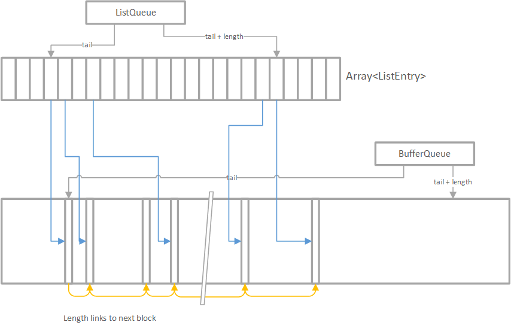

# Design for Thread-Safe Circular Buffer Allocator

Embedded systems must have a deterministic mechanism in which they can allocate
memory and have a reasonable guarantee that the memory is obtainable. In some
circumstances, it is important to allocate memory without using Operating System
primitives to avoid locks and context switches. This article describes the
algorithm for a lock-free circular buffer of fixed memory size where 64-bit
atomic compare exchange is available (all modern 64-bit systems, as well as many
32-bit systems). It avoids all context switches for deterministic behaviour.

## Operations

Two operations shall be made available:

```c
void *alloc(uint32_t size);
void free(void *addr);
```

They behave the same as the standard *libc* `malloc()` and `free()` routines. To
be compatible with existing software, addresses returned should be aligned to
16-bytes.

### Usage

The algorithm uses buffers, one is a queue (the free list) and the buffer is
similar to a linked list. The usage behaviour is IPC mechanisms that require
tracing. The IPC would allocate lots of small chunks of memory, and there could
be many IPC channels allocating memory. The transmission of IPC to another
process might occur very quickly, such that the memory cannot be freed yet,
until the IPC data is traced.

The IPC tracing mechanism occurs in an ordered fashion. For a single IPC
mechanism, it will always free in the order that memory is allocated. As there
are lots of IPC channels assumed using the same buffer, it can be seen that
freeing of buffers occurs in an approximate order (not strict).

Thus, a buffer that is allocated, should be freed within a reasonable time and
the oldest buffers are expected to be freed first. This makes it suitable to use
a circular buffer for management.

So long as buffers are freed, there can be no fragmentation. We don't try to
reallocate memory that is freed, unless it is at the end of the buffer, making
the allocation very fast (no need to search for lists). A free is also fast, as
it must only traverse the tails until it finds a non-free region. The allocation
and free mechanisms are considered deterministic as they're bounded by the size
of the "free list" and are very short in duration. The algorithm presented here
could be tweaked to limit the amount of walking needed in addition, balancing
the time for allocation (very fast) and free.

## Datastructures Used

Two datastructures are used. Both are fixed in size. One is a small "free" list
(implemented as a circular queue of an array), the other is a buffer
(implemented as a circular queue of arbitrary byte-sized buffers).

The *List* contains a list of all allocated and returned blocks given to the
user. The most important property of the list is it consists of fixed size
elements, and unallocated entries are of well defined values.

The *Buffer* is still a datastructure, can be allocated in a different memory
region and all pointers returned by `alloc` are within this region.

### Summary

The diagram gives an overview of the datastructures:

 

To summarize:

* A `ListEntry` points to the offset in a the *Buffer*. It has a reverse entry
  to `ListEntry` to make it easier to find when freeing.
* A `ListEntry` is changed atomically and has four states: in allocation (ZERO);
  failed allocation; allocated; and ready for free. Because of this, the array
  of `ListEntry` elements is like a free list, it is used when freeing.
  * This is critical to this design, that each element is default ZERO and of
    fixed size, else atomic updates can't be made.
* A `ListEntry` works because the default state is ZERO, so we just need to
  update the `ListQueue` and it's automatically in the "in allocation" state to
  guard against unwanted frees.
* The `Buffer` is also a queue. We only allow memory to be returned when the
  tail is free.
* The `BufferBlock` is at the beginning of every *block*. Because everything
  between the `buffer_queue.tail` and `buffer_queue.length` is allocated, this
  forms a linked list type structure, with lengths to get to the next block
  instead of pointers.
* If a `BufferBlock` has -1 as the `list_entry_offset`, then it means this block
  is already freed and is waiting for the tail to catch up. Otherwise it is
  assumed in use.

### The Allocated List

The *List* consists of an array of a structure, such as:

```c
typedef struct __attribute__((__packed__)) _ListEntry {
    int flags:8;
    int offset:28;
    int length:28;
} ListEntry;
```

The datastructure supports a *Buffer* of size of up to 32-bits aligned on
16-byte boundaries. It is compacted such that 28-bits multiplied by 16-byte
boundaries is 32-bit in size. By using such a compression mechansism we can:

* Support up to 4GB for each memory pool
* Do atomic compares and exchanges for 8-bytes so that updates can be made
  without spin-locks, mutexes or other Operating System constructs that could
  lead to a context switch.

The `flags` consists of one-bit:

* free (we'll call it `flags.free`).

The cases for interpreting the `ListEntry` for the datastructure:

* All ZERO. Indicates that the entry has an active allocation on-going
* `length` == 0, with `flags.free` == 1, indicates this was a
  failed allocation and on reclaim can be freed. That the length is zero
  indicates no entry in the *Buffer* exists.
* `length` != 0, with `flags.free` == 0, indicates the allocation is in use and
  is not freed.
* `length` != 0, with `flags.free` == 1, indicates the allocation has been
  freed, but still takes memory.

The *List* is modelled as a circular queue, but the enqueue and dequeue routines
do not exist, and are customly implemented by the `free()` method.

The structure for the queue is:

```c
typedef struct __attribute__((__packed__)) _ListQueue {
    uint32_t tail;
    uint32_t length;
} ListQueue;

ListQueue list_queue;
```

It is important that this datastructure can be atomically updated, so that it is
8-bytes in size. This allows the position of the queue, as well as the length of
the queue to be atomic, such that adding and removing entries to the queue is
atomic.

### The Buffer

The *Buffer* is a large region of memory. Each offset into the buffer returned
to the user should be aligned to 16-bytes. At the start of each *block* in
memory, there will be a small management region of 16-bytes (not all of this is
used, by alignment dictates this is the smallest size).

```c
typedef struct __attribute__((__packed__)) _BufferBlock {
    uint32_t list_entry_offset;
    uint32_t block_length;
} BufferBlock;
```

When a *block* is allocated, the `list_entry_offset` points to the index number
into the array of `ListEntry` elements. For lock-less behaviour, it is expected
that this datastructure is 8 bytes or less.

The *Buffer* is modeled as a queue of *blocks*, where blocks are assumed
allocated from the tail until the head. The data-structure for the *Buffer* is:

```c
typedef struct __attribute__((__packed__)) _BufferQueue {
    uint32_t tail;
    uint32_t length;
} BufferQueue;

BufferQueue buffer_queue;
```

## Algorithms

The algorithms must be lock-free, avoid any spinlocks, mutexes and anything else
that can take excessive CPU time or cause a context switch due to contention. It
relies on CPU intrinsics such as "compare and exchange" of 8 bytes.

Let us define:

* T<sub>L</sub> as `ListQueue.tail`
* L<sub>L</sub> as `ListQueue.length`
* H<sub>L</sub> = (T<sub>L</sub> + L<sub>L</sub>) % N<sub>L</sub>
  * where N<sub>L</sub> is the size of the array *List*

Similarly, we have:

* T<sub>B</sub> as `BufferQueue.tail << 4` in units of bytes, alignment of 16
* L<sub>B</sub> as `BufferQueue.length << 4` in units of bytes, alignment of 16
* H<sub>B</sub> = (T<sub>B</sub> + L<sub>B</sub>) % N<sub>B</sub>
  * where N<sub>B</sub> is the size (in bytes) of the buffer.
  * Note, while we discuss bytes, an obvious optimisaton in the implementation
    could treat N<sub>B</sub> as the number of 16-byte regions.
* F<sub>B</sub> = N<sub>B</sub> - H<sub>B</sub> where T<sub>B</sub> + L<sub>B</sub> < N<sub>B</sub>; or
* F<sub>B</sub> = N<sub>B</sub> - L<sub>B</sub> where T<sub>B</sub> +
  L<sub>B</sub> >= N<sub>B</sub>; is the maximum free contiguous memory region
  available.

### Allocation

The allocation routine must support multiple threads calling `alloc(uint32_t
size)` simultaneously, which acts on the same *List* and *Buffer*. Later, we'll
see that it must handle also thread-safe behaviour with `free()`.

Sequence of Steps for an allocation for the size of bytes `size`.

* Allocate a new entry at the end of *List*
  * We know that the default values that are not allocated are ZERO. We use this
    later to exploit in the `free` algorithm.
  * Do this in a lockless way. Take an atomic copy of `list_queue`.
  * Increment L<sub>L</sub>. If it exceeds the boundaries, then return `NULL`
    that there is not enough space to allocate.
  * Do a compare/exchange. If the value of `list_queue` has changed, repeat.
  * NOTE: Now we've allocated space in our *List* which will be used for freeing
    memory later.
* Allocate a *block* in the *Buffer*.
  * NOTE: The contents of the buffer are undefined and cannot be relied upon.
  * Take an atomic copy of `buffer_queue`.
  * Define `nsize` as `align(size, alignment) + min(sizeof(BufferBlock),
    alignment)` where `alignment` is 16-bytes. `nsize` is then the buffer data
    we want to allocate (moved up to the next 16-byte alignment) plus a 16-byte
    region for free optimisations.
  * Check that it is possible to allocate `nsize` bytes contiguously from
    H<sub>B</sub>.
    * If N<sub>B</sub> - L<sub>B</sub> < `nsize`, we have insufficient memory,
      then return `NULL`.
      * Before returning `NULL`, it might be attempted that a rollback on
        `ListEntry` is made, which is only possible, if no new allocations have
        been done in-between. This step is an optimisation and is completely
        optional for the algorithm.
      * If the rollback is not done (or failed), atomically set the entry with
        `length` of zero and `flags.free` is set. This will tell the `free`
        routine that the entry in the *List* is free without needing to update
        the *Buffer* metadata.
    * e.g. if T<sub>B</sub> + L<sub>B</sub> < N<sub>B</sub>, then if
      N<sub>B</sub> < `nsize` we must handle the case that we need to roll-over
      to the next contiguous region. That is, F<sub>B</sub> < `nsize`.
      * `nsize += F_B`. Like in the previous step, ensure we have enough memory,
        if not, return `NULL` after updating the *List* data structure, like in
        the previous step.
    * If T<sub>B</sub> + L<sub>B</sub> >= N<sub>B</sub>, it is guaranteed that
      the free space in the buffer is contiguous as there is no wrap-around. If
      F<sub>B</sub>. Ensure that `nsize` < F<sub>B</sub>.
  * Increment L<sub>B</sub> by `nsize`. Atomically update `buffer_queue` with a
    compare/exchange ensuring that the value hasn't change since the initial
    read. If the value has changed, another allocation has occurred in-between
    and the step must be repeated.
* Now both the index in *List* and the region in *Buffer* are allocated. The
  `ListEntry` having a value of ZERO indicates that an allocation is in
  progress.
  * Write the metadata in the *block* in *Buffer* so that when the user calls
    `free(addr)`, we can identify quickly the `ListEntry`. It is advisable to do
    this first, as the `free()` routine will not see this block until we're
    done. But so long as the `ListEntry` indicates `flag.free == 0`, this is
    only an extra protection.
    * In case of no wrap-around, typecast the start of the *block* to
      `BufferBlock` and set `list_entry_offset` to the start of the *block*, and
      `block_length` to be `nsize`. The address we return will be immediately
      after the `BufferBlock`.
    * In case of wrap-around, we have to allocate effectively two *blocks*. The
      first will be used as a gap, which is used later by `free()` to ensure the
      tail is properly incremented. The second is the *block* containing the
      memory region the user will get from the return of this call.
      * Typecast the start of the *block* to `BufferBlock` and set the
        `list_entry_offset` to -1, and the `block_length` to the space from the
        current position until the end of the buffer. This indicates there is no
        `ListEntry` and a free can reclaim this region when the previous block
        is free.
        * Note, there is a special use case that if there are no previously
          allocated blocks, we can atomically update the `buffer_queue` so that
          the tail and the length point to the beginning of the buffer. This is
          an optimisation for memory usage and doesn't change the algorithm.
      * Typecast a second `BufferBlock` from the offset 0 of *Buffer* and set
        `list_entry_offset` for this block. The address we return will be
        immediately after the `BufferBlock` (e.g. index 16 of the byte array
        *Buffer*). The `free` function must be able to find the `BufferBlock`
        when given only the address returned by the `alloc` function.
  * Update the `ListEntry` with the offset of the *block* with the matching
    `list_entry_offset`, the total size of the *block* (e.g. `nsize`), doing so
    atomically.
    * The datastructures are complete. Note that this block still cannot be
      freed until the `alloc()` routine returns.

### Free

The free routine is simpler, and uses the *List* to iterate through all *blocks*
in *Buffer* which are no longer needed, incrementing the tail (and thus
decrementing the length) effectively allowing memory to be reused in the
*Buffer*.

Note, it is illegal to free memory which has already been freed or which has not
been allocated, i.e. it is only allowed to call `free` exactly once for one
address returned by `alloc`.

Given an address, which is returned by `alloc(size)`:

* The first step is to mark the *block* as free. This is an atomic operation and
  may only occur once.
  * Subtract 16 bytes, which is `min(sizeof(BufferBlock), alignment)` bytes,
    from the address. Typecast this to `BufferBlock` and obtain the offset into
    *List* which is a `ListEntry`.
  * Update the `ListEntry` so that `flag.free == 1`. Note that the
    `ListEntry.length` must always be non-zero. If it is zero, then there is an
    error in the implementation, or the user called an invalid address.
* The next step is to iterate over the *List* updating the tail of the *Buffer*
  T<sub>B</sub> and the length L<sub>B</sub> as the *List* is enumerated.
  * From the tail of *List*, get the *ListEntry*
  * If it is ZERO, or `flag.free == 0` (the test should be equivalent), then
    exit the loop. The entry remains only marked as free for now, but is not yet
    available for reallocation.
  * If `flag.free == 1` there are two cases: there's buffer, or there's no
    buffer *block*.
    * If `length == 0`, this was a failed allocation, and we can now reuse the
      `ListEntry`. Do an atomic compare/exchange setting the entry to ZERO.
      * If the `ListEntry` changed until now, then another `free()` is running
        at the same time and we can exit in this thread, allowing the other
        thread to continue the operation.
    * Else, if `length != 0`, we must calculate the new tail for *Buffer*.
      * Do an atomic change of the `ListEntry` to ZERO. If the value changed
        from the initial value by the time this is done, it means another thread
        is freeing the block and exit the loop. Otherwise, it now appears that
        it is in use, and any other free operation will see this and exit
        instead, allowing us to now properly update the tail of *Buffer*. The
        tail and the length of the *List* has not yet been updated.
      * In the list entry before setting to zero, we have the offset into the
        buffer.
        * Take the offset into *Buffer* and get the `BufferBlock`. It contains
          the Length and the index.
        * If the `ListEntry.offset` (before it was changed to zero) is the same
          as the tail of the *Buffer*, we now atomically update the
          `buffer_queue` by moving the tail forward the
          `BufferBlock.block_length`.
          * If the initial value of `buffer_queue` is different to the time it
            is being changed, recalculate (as an allocation routine has occurred
            in parallel on another thread).
          * An alloc that occurs at the same time can now claim this new memory
            region
          * From the old `BufferBlock.block_length` we just freed, get the next
            `BufferBlock` and read it. If the `list_entry_offset` is -1, then
            this block can also be freed. Continue this step as many times as
            necessary until the length is not -1. We know all these blocks are
            allocated, and effectively chained by the `block_length` so this is
            a safe operation (data is well defined, until we update the tail).
          * Atomically increment the `list_queue` by incrementing the
            `list_queue.tail` by one, and decrementing the `list_queue.length`
            by one. Again, if the `list_queue` changed since the initial value,
            it indicates that an allocation routine was running in parallel on
            another thread. Recalculate based on the new information and try
            again.
        * Else, if the `ListEntry.offset` is not the same as the tail, we can't
          free memory from *Buffer* yet. As we will remove the index entry, do
          an atomic change of the *block* `list_entry_offset` to be -1. This
          allows another call to `free()` later to release allow the buffers to
          be reused when all buffers prior are now free.
